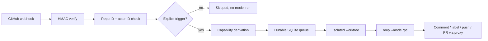

<div align="center">

# carter-omp

<!-- trace:v1 id=doc.readme work=WORK-CO-Q8Z1HJJJ satisfies=REQ-CO-XM327PK3 -->

**An explicitly-invoked GitHub coding agent. One label or one mention starts it; everything else is inert.**

[](https://github.com/carterlasalle/carter-omp/actions/workflows/ci.yml)


[Quick start](#quick-start) · [How it works](#how-it-works) · [Operator workflow](#operator-workflow) · [Safety model](#safety-model) · [Documentation](#documentation)

</div>

carter-omp drives [`omp --mode rpc`](https://github.com/can1357/oh-my-pi) as a subprocess against a per-issue git worktree, then writes back to GitHub through a sidecar that holds the credential. Ordinary GitHub activity (issue opened, comments, PR opened/synchronized, reviews, CI) never starts the agent. Carter starts it with one label or one mention:

- Add the `carter-omp` label to an issue/PR, or
- Comment `@carter-omp <directive>` (e.g. `@carter-omp fix the race and add a regression test`).

## How it works
<!-- trace:v1 id=doc.readme-how-it-works work=WORK-CO-Q8Z1HJJJ -->



GitHub is untrusted input. The signed webhook's `sender.id` and `repository.id` are the only identity. `TriggerContext` plus a fixed `Capability` set is derived in deterministic host code before anything is queued — the model never decides authorization, and every host tool and proxy endpoint re-enforces it.

## Capabilities
<!-- trace:v1 id=doc.readme-capabilities work=WORK-CO-Q8Z1HJJJ -->

| Area | What an authorized run provides |
|---|---|
| Coding | Triage, bug reproduction, file edits, shell commands, LSP, tests — in an isolated per-issue worktree |
| Publishing | Commit, push a `carter-omp/*` branch, open a PR, request reviewers |
| Conversation | Respond to comments and reviews, review incoming PRs (read-only caps) |
| Search | Issue/commit search, reviewer requests, thread context with provenance |
| Sessions | Persistent per-issue transcripts (`--continue` resume), crash recovery, durable SQLite queue, per-issue serialization |
| Operations | Dashboard with trigger/actor/decision/capability columns, audited host-tool actions, cancellation, model/thinking overrides |
| Release repair | Elevated default-branch/tag capabilities via explicit `@carter-omp release-fix` only |

## Quick start
<!-- trace:v1 id=doc.readme-quick-start work=WORK-CO-Q8Z1HJJJ -->

### Prerequisites
<!-- trace:v1 id=doc.readme-prerequisites work=WORK-CO-Q8Z1HJJJ -->

- Python `3.12` with [uv](https://docs.astral.sh/uv/)
- Corepack with Yarn `4.9.2` (pinned in `web/package.json`)
- Docker (for production) or Git (for local dev)

```bash
git clone https://github.com/carterlasalle/carter-omp
cd carter-omp

uv sync --all-extras
corepack enable
yarn --cwd=web install --immutable

cp .env.example .env
$EDITOR .env
openssl rand -hex 32   # CARTER_OMP_GH_PROXY_HMAC_KEY
openssl rand -hex 32   # GITHUB_WEBHOOK_SECRET
```

### Run locally
<!-- trace:v1 id=doc.readme-run-locally work=WORK-CO-Q8Z1HJJJ -->

```bash
uv run pytest -q -p no:cacheprovider --ignore=tests/test_worker_smoke.py
uv run ruff check src tests
uv run ruff format --check src tests
uv run carter-omp --help
```

### Deploy the bot
<!-- trace:v1 id=doc.readme-deploy-bot work=WORK-CO-Q8Z1HJJJ -->

1. Create a private GitHub App ("Carter OMP"): webhook URL + secret, permissions Contents/Issues/Pull requests RW + Metadata R (+ Actions R only for release diagnosis). See `docs/github-app.md`.
2. Install it on **Only select repositories**.
3. Resolve Carter's immutable user ID (`gh api users/carterlasalle --jq '{id, login, type}'`) and fill `CARTER_OMP_AUTHORIZED_USER_IDS`.
4. Fill repo IDs (`CARTER_OMP_REPO_IDS`).
5. Configure the model gateway (`CARTER_OMP_MODEL`, provider credentials).
6. Start: `docker compose up -d --build`
7. Validate: `docker compose exec carter-omp carter-omp doctor`
8. Add the `carter-omp` label to selected repos.
9. Test with a sandbox issue: open → nothing happens → add label → triage/fix/PR.

Full sequence with App wiring and secret mounts: [Setup](docs/setup.md).

## Operator workflow
<!-- trace:v1 id=doc.readme-operator-workflow work=WORK-CO-Q8Z1HJJJ -->

1. Someone opens an issue. Nothing happens.
2. Carter reviews it. To run the agent, add the `carter-omp` label — or comment `@carter-omp investigate this but don't change code yet`.
3. The agent triages, reproduces, edits, tests, pushes a `carter-omp/*` branch, opens a PR, and comments back.
4. Later: `@carter-omp go ahead and implement it`. On its PR: `@carter-omp address the latest review comments` — same session resumes, same branch, review text as context, Carter's comment as the authoritative directive.
5. Small control commands: `@carter-omp status` (DB answer, no model), `@carter-omp stop` (cancel without a model turn), `@carter-omp review` / `resume` / `release-fix`.

## Safety model
<!-- trace:v1 id=doc.readme-safety-model work=WORK-CO-Q8Z1HJJJ -->

carter-omp intentionally makes unauthorized paths inert:

- No trigger, no run: opened issues/PRs, ordinary comments, reviews, and CI outcomes queue nothing (`state=skipped`, zero model invocations).
- The label is a one-shot button: the signed `labeled` event authorizes, the bot consumes the label (`carter-omp:running` → `done`/`needs-input`/`failed`), and state labels never trigger.
- Capabilities are fixed per run by trusted routing code; the model cannot request more, and subagents inherit (never escalate).
- Host tools are bound to the current thread/branch/repo; the proxy re-checks repo, thread, branch namespace, and action on every call.
- Repository content (issues, diffs, `AGENTS.md`, test output, CI logs) is untrusted task data — it cannot grant permissions or override `TriggerContext`.
- Secrets never reach the agent: the proxy holds the GitHub credential, the runner env is scrubbed, containers run non-root with dropped capabilities and no Docker socket.

The normative threat model is in [Security](docs/security.md). Trigger semantics are in [Triggers](docs/triggers.md). Architectural decisions are indexed in [docs/adrs/](docs/adrs/).

## Deployment status
<!-- trace:v1 id=doc.readme-deployment-status work=WORK-CO-Q8Z1HJJJ -->

Ambient triggers are **disabled by default**. `CARTER_OMP_AUTO_ISSUE_TRIAGE`, `CARTER_OMP_AUTO_PR_REVIEW`, `CARTER_OMP_AUTO_COMMENT_FOLLOWUPS`, release sentinel, question autoclose, and replay are all off unless explicitly enabled. A freshly cloned repo with the example env authorizes nothing until Carter's user/repo IDs are filled in.

Before trusting the bot on a real repo:

1. Fill IDs and run `carter-omp doctor` until every identity mapping verifies.
2. Add the `carter-omp` label to one sandbox repo.
3. Run the unauthorized-actor acceptance scenario in `docs/security.md` (stranger labels/mentions/prompt-injection PR → zero runs, all denied).
4. Authorize one issue and confirm triage → fix → `carter-omp/*` push → PR.

## Documentation
<!-- trace:v1 id=doc.readme-documentation work=WORK-CO-Q8Z1HJJJ -->

| Document | Purpose |
|---|---|
| [Documentation index](docs/setup.md) | Setup, triggers, architecture, security, App wiring, provenance |
| [Getting started](docs/setup.md) | Install, GitHub App, IDs, secrets, compose up, doctor |
| [Triggers](docs/triggers.md) | Label/mention semantics, routing table, what does NOT trigger |
| [Architecture](docs/architecture.md) | Orchestrator/proxy topology, queue, worktrees, RPC |
| [Security](docs/security.md) | Threat model, trusted vs untrusted, fail-closed rules |
| [GitHub App](docs/github-app.md) | App permissions, install scope, token strategy |
| [Upstream parity](docs/upstream-parity.md) | Every robomp trigger/tool/workflow and its carter-omp replacement |
| [Agent notes](docs/agent-notes.md) | Docker/CI/trace/test learnings for operators and agents |
| [Contributing](CONTRIBUTING.md) | Development workflow and pull-request standards |
| [Security policy](SECURITY.md) | How to report a vulnerability |
| [Changelog](CHANGELOG.md) | Notable changes |

## Contributing
<!-- trace:v1 id=doc.readme-contributing work=WORK-CO-Q8Z1HJJJ -->

See [CONTRIBUTING.md](CONTRIBUTING.md). Quick check before pushing:

```bash
uv run ruff check src tests
uv run ruff format --check src tests
uv run pytest -q -p no:cacheprovider --ignore=tests/test_worker_smoke.py
```

Dashboard:

```bash
yarn --cwd=web lint
yarn --cwd=web typecheck
yarn --cwd=web test
yarn --cwd=web build
```

## License
<!-- trace:v1 id=doc.readme-license work=WORK-CO-Q8Z1HJJJ -->

MIT — see `LICENSE`. Derived from `can1357/oh-my-pi` `python/robomp`; see `docs/upstream.md` and `THIRD-PARTY-NOTICES.md`.
